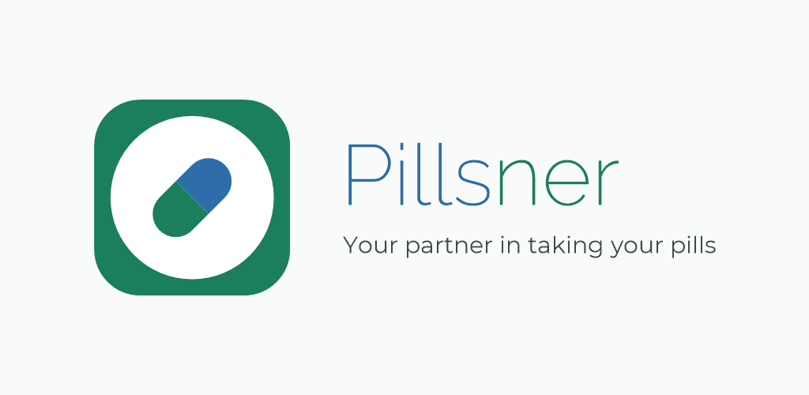
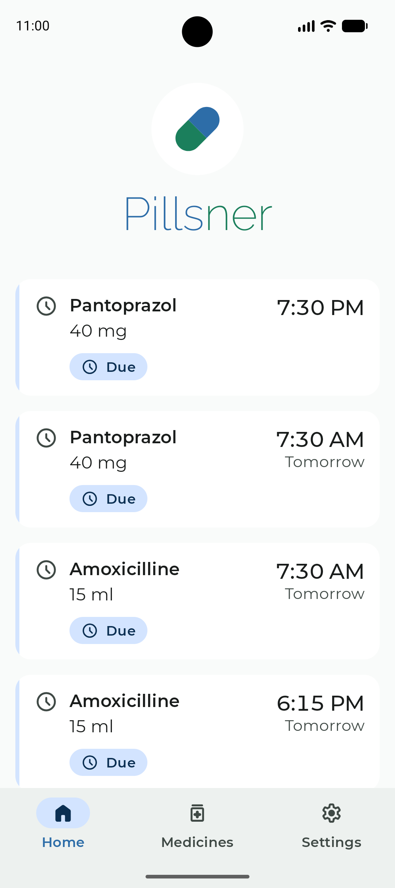
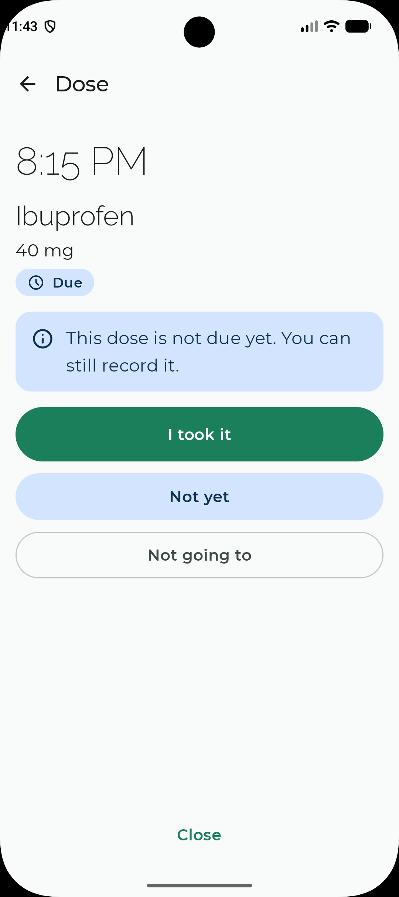
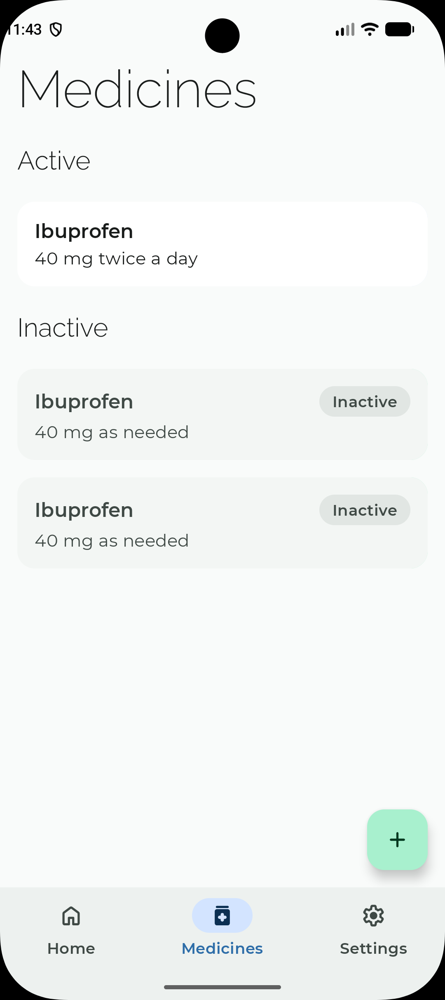
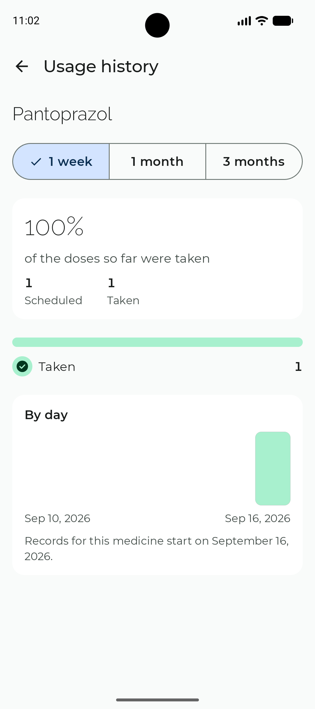

# Pillsner

**Your partner in taking your pills.**

Pillsner is a native Android reminder app that helps you take your medication on time, every time. The name is a play on *Pills* and *Partner*: the app is meant to be the reliable companion that taps you on the shoulder when a dose is due, keeps track of what you have taken, and stays out of your way the rest of the time.

**[Get it on Google Play](https://play.google.com/store/apps/details?id=nl.hexmaster.pillsner)** — free, no account required, available for Android 8.0 (API 26) and newer, with an optional companion app for Wear OS 3 (API 30) and newer.

---

## Why Pillsner

Missing a dose, or taking one twice because you forgot you already did, is a common and frustrating problem. Most people do not want a full health platform for this. They want a small, trustworthy app that:

- reminds them at the right moment, reliably, even when the phone is idle;
- makes confirming a dose a one-tap action;
- shows at a glance what is due today and what has already been taken;
- keeps their medication data private and on their own device.

Pillsner is built around exactly those needs and nothing more.

## Screenshots

| Home | Confirm a dose | Medicines | Usage history |
| --- | --- | --- | --- |
|  |  |  |  |

## Features

Here is what Pillsner does for you today, with more on the way.

**Medication management**
- A medicine overview listing what you take, split into active and inactive medicines, each with a plain-language description of its schedule, and a large add button to enter a new one. Swipe a tile sideways to activate or deactivate that medicine; nothing is ever deleted.
- Add a medication with a name, a default dose and its unit (mg, ml, tablet, drop, and so on), the dates you take it between, and who prescribed it.
- Give a medicine as many schedules as it needs, each with its own amount: 40 mg every 12 hours on top of 20 mg once a day at the weekend.
- Tap a medicine to open it and change anything: its name, its dose, its dates, who prescribed it, its schedules, and whether you are currently taking it.
- **A medicine is never deleted.** Stopping one deactivates it; the medicine, its schedules and every dose it ever produced stay on your device. Editing a medicine never rewrites what you already took: doses you have answered keep the name and amount they were taken under, and only what is still ahead of you follows the change.
- Track remaining stock and get a heads-up when a refill is due.

**Schedules and reminders**
- Flexible schedules: fixed times of day, every N hours, specific weekdays, or as-needed medication without a schedule.
- Reliable local notifications that fire on the exact minute, including when the device is dozing, and that survive a reboot, an app update, a clock change and a move to another time zone.
- Answer a reminder in one tap, without opening the app: **I took it**, **Not yet** (a 15-minute snooze) or **Not going to**. A dose you never answer becomes missed when the next one is due, or 24 hours later, whichever comes first.
- A reminder you do not answer asks again every 15 minutes, four times at most, and never past the moment the dose lapses. Any of the three answers stops it at once, and **Not yet** starts the quarter of an hour over.
- **A scheduled medicine puts an alarm icon in your status bar.** Pillsner sets its reminders as real alarms, the one kind Android and the phone makers do not defer or drop — which is the whole point of an app that reminds you to take medication. The icon is the honest consequence: you have set an alarm.
- Pillsner never opens a system dialog you did not ask for. If a dose ever comes due and no reminder arrives, the Home screen says so, with a button that takes you to the background settings where you can stop it happening again — the phone maker's own auto-start screen where there is one, Android's battery-optimisation list otherwise. Until that happens there is nothing to report and nothing is shown.
- The same reminder, with the same three answers, appears on a paired Wear OS watch.

**On your wrist**
- A Wear OS watch app showing what you have to take in the next six hours, soonest first, with the name, the amount and the time. A dose whose time has passed and that you have not answered stays at the top, because it is still to be taken.
- Nothing scheduled in those six hours says so plainly, and a watch that cannot reach your phone says that too, so a stale list is never mistaken for a live one.
- The watch app only shows. Answering a dose stays where it was: the reminder notification on the watch, or the phone.
- It reads in the language the phone app is set to, not the watch's own.

**Home**
- A welcome screen showing your upcoming doses, soonest first, so you can see at a glance what needs taking next.

**Intake tracking**
- Confirm a dose straight from the notification or from the app.
- A daily overview showing what is due, what is taken, what was skipped and what was missed.
- A history view so you or a caregiver can see adherence over time.

**Language**
- Pillsner is available in English, Dutch, German, French, Spanish and Portuguese, and follows your phone's language on its own. You can override it in Settings; the new language appears the next time you start the app, and Pillsner says so until you do.
- Everything follows the chosen language, not only the screens: dates, times, weekday names, decimal separators, how names are sorted, and the reminder that arrives while the app is closed.

**What Pillsner is, stated plainly**
- Before you add your first medicine, Pillsner shows you a disclaimer and asks you to accept it and the terms of service. It says what the app is not: not a medical device, not a source of medical advice, and not something to rely on as your only reminder, because a phone can be off, silent or out of battery.
- Both documents stay readable from Settings, together with the date you accepted them. They are versioned; if either is revised, you are asked again before you add your next medicine. Nothing you already have is ever blocked: existing medicines, reminders and recording a dose keep working.

**Privacy by default**
- All data lives on the device. There is no account, no cloud sync and no analytics unless explicitly added and clearly disclosed in a future release.
- With the watch app installed, the names, amounts and times of the doses you still have to take also travel to your watch. They go over the direct Bluetooth or local network link between the two paired devices, through Google Play services, which stores them on the watch; nothing goes to a server, and neither app asks for internet access. Uninstalling the watch app removes them.
- An optional app lock protects the app with a PIN and, once set up, biometric unlock. Screenshots and the recent apps thumbnail are hidden while it is on.
- You can change your PIN in Settings without turning the lock off. Changing the PIN, turning biometric unlock off and turning the lock off each ask you to confirm it is you first — with your fingerprint or face where you have one, and with the PIN itself for turning the lock off. Each confirmation is good for that one change.
- On the lock screen a reminder can show only "Time for your medicine", never the name or the amount, whenever your phone is set to hide sensitive notifications.

**Starting over**
- Settings ends with a danger zone holding one button: **Reset app**. It erases every medicine, every schedule and your complete intake history from the device, so a phone being handed on, or an app filled with a trial run, does not have to be uninstalled to be emptied.
- It cannot be hit by accident: a scroll to the bottom of Settings, a tap, a checkbox reading "I understand all data will be erased permanently" that has to be ticked before the button works, and a second tap. Cancelling, tapping outside or pressing back erases nothing. There is no undo, and the app does not pretend there is.
- Your language, your app lock and the documents you accepted survive the reset. The app stays configured; it is simply empty.

## Permissions

Pillsner asks for as little as it can, and for nothing that sends data anywhere. It declares **no internet permission at all**.

| Permission | Why |
| --- | --- |
| `POST_NOTIFICATIONS` | A reminder is a notification. Without it Pillsner cannot remind you of anything, and the Home screen says so. |
| `USE_EXACT_ALARM` (Android 13+), `SCHEDULE_EXACT_ALARM` (Android 12) | A dose due at 08:00 has to be announced at 08:00. Android reserves exact alarms for apps whose core function is alarms or reminders; that is exactly what Pillsner is. Without it reminders fall back to a ten-minute window and the Home screen warns you. |
| `RECEIVE_BOOT_COMPLETED` | Restarting the phone clears every pending alarm, so Pillsner has to set its own again. |
| `FOREGROUND_SERVICE`, `FOREGROUND_SERVICE_SHORT_SERVICE` | When an alarm goes off, Pillsner has a few seconds to open its database and work out what is due. A short foreground service gives it a real window; it shows a quiet "Checking your medicines" notice for a second or two and then stops. |
| `USE_FULL_SCREEN_INTENT` | So a due dose presents itself on a locked or busy phone rather than waiting silently in the notification shade. From Android 14 it is granted at install only to apps whose core function is alarms or calling; Pillsner is an alarm app, and where it is not granted the reminder degrades to a heads-up notification. |

## Technology

Pillsner is a native Android application written in Kotlin.

| Area | Choice |
| --- | --- |
| Language | Kotlin |
| Platform | Android (native) |
| UI toolkit | Jetpack Compose with Material 3 |
| Architecture | Single-activity, MVVM style with unidirectional data flow |
| Persistence | Room (SQLite) on the device |
| Scheduling | Android alarm and notification APIs for exact, reliable reminders |
| Wearable | Wear OS companion app with Compose for Wear OS (Material 3 for Wear) |
| Phone to watch sync | Wearable Data Layer (Google Play services), over the paired-device link only |
| Design | `docs/design-system.md`: brand colour schemes for light and dark, bundled Montserrat and Raleway, Material 3 tokens; no dynamic colour |
| Build system | Gradle with the Kotlin DSL, versions pinned in a version catalog (see Toolchain below) |
| IDE | Android Studio (latest stable) |

Any change to this table should go through the spec-driven workflow described in [CONTRIBUTING.md](CONTRIBUTING.md#development-workflow), so that the reasoning is recorded alongside the decision.

Alongside the Android app, `src/website/` holds a separate, self-contained deliverable: a static, single-page, six-language marketing site describing Pillsner and linking to its Google Play listing. It is built with [Hugo](https://gohugo.io/) and has no runtime server, no analytics and no third-party trackers — see `src/website/README.md`. It is not a Gradle module and does not affect the app's toolchain, build or permissions in any way.

| Area | Choice |
| --- | --- |
| Static site generator | Hugo, extended edition, 0.165.0 |
| Languages | English, Dutch, French, Spanish, Portuguese, German |
| Hosting | Azure Static Web Apps, Free tier; deployed by `.github/workflows/website.yml` |

## Repository layout

| Path | Purpose |
| --- | --- |
| `src/` | The Gradle project. Open this folder in Android Studio. |
| `src/app/` | The phone application. |
| `src/wear/` | The Wear OS companion application. It shares its application id and signing with the phone app, which is what lets the two talk. |
| `src/shared/` | Plain Kotlin: the phone-to-watch sync contract, so both apps compile against one wire format. |
| `src/website/` | The public marketing website: a static, single-page, six-language Hugo site. It is **not** part of the Gradle project — its own toolchain, own config, no shared files with `src/app`/`src/wear`/`src/shared` — but lives under `src/` at the maintainers' direction. See `src/website/README.md`. |
| `openspec/` | Spec-driven planning: `specs/` holds the agreed behaviour of the app, `changes/` holds in-progress change proposals, and `changes/archive/` holds completed ones. |
| `docs/` | The design system (`design-system.md`) and its visual companion (`design-system.html`): colours, typography, components and accessibility rules for the app. |
| `.github/workflows/` | `ci.yml` tests, lints and assembles every pull request and push to `main` that touches anything outside `src/website/`; `release.yml` builds, signs and publishes both bundles to Google Play on every such push to `main`, then tags the commit and creates the GitHub release; `release-notes.yml` drafts brief, bilingual (EN/NL) Play "what's new" text from the OpenSpec changes shipped in a `development` → `main` pull request and posts it as an updatable PR comment for a human to review and hand-copy — it never commits or blocks the release; `website.yml` builds the Hugo site and deploys it to Azure Static Web Apps on every push to `main` that changes `src/website/**`. The two sets of workflows never both run for the same push. |
| `distribution/whatsnew/` | Play release notes, one plain-text file per listing language. Update them in the change that earns them. |
| `GitVersion.yml` | How the release version is derived: every commit on `main` bumps the patch, and the tag written by a successful release becomes the next baseline. |
| `.claude/` | Configuration for AI-assisted development: skills and slash commands for the OpenSpec workflow, the branching-model skill (`git-workflow`), the GitHub sync skill, plus the design agent and UI skills that enforce the design system. |
| `CHANGELOG.md` | Full release notes for every release, newest first. The 500-character Play version lives in `distribution/whatsnew/`. |
| `CLAUDE.md` | Working instructions for AI coding assistants contributing to this repository. |
| `CONTRIBUTING.md` | Prerequisites, toolchain, build/run instructions, the OpenSpec development workflow and the branching model, for anyone building Pillsner locally. |
| `LICENSE` | MIT license. |

## Contributing

Want to build Pillsner yourself, or send a pull request? Prerequisites, the toolchain, build/run instructions, the OpenSpec development workflow and the branching model all live in [CONTRIBUTING.md](CONTRIBUTING.md).

Bug reports and feature ideas can be filed as GitHub issues on this repository.

## License

Pillsner is released under the MIT License. See the [LICENSE](LICENSE) file for details.

Copyright (c) 2026 HexMaster
